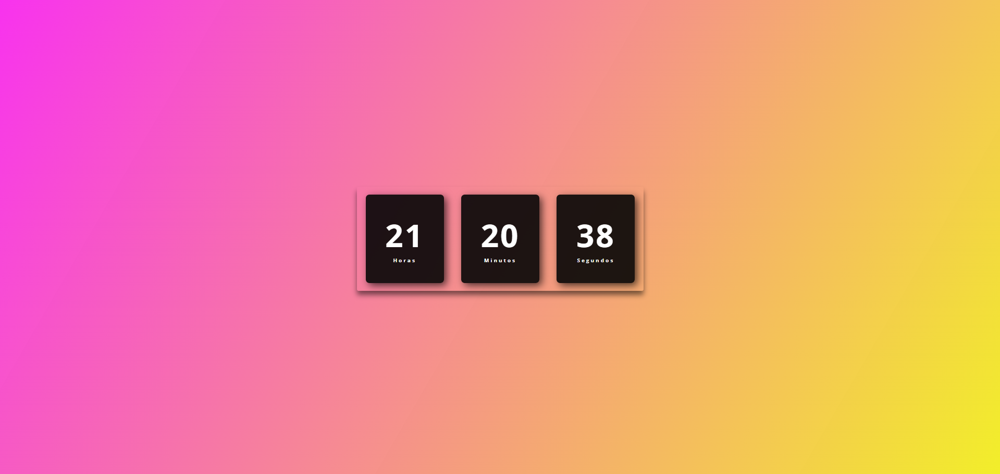

# 🕒 Relógio Digital



## 📌 Descrição

Este é um **Relógio Digital** desenvolvido com **HTML, CSS e JavaScript**. Ele exibe a hora atual em tempo real, com um design moderno e uma interface minimalista.

## 🚀 Funcionalidades

- ⏳ Atualização automática dos segundos, minutos e horas.
- 🎨 Interface moderna com efeito de **sombra** e **gradiente** no fundo.
- 📱 Responsivo e compatível com diferentes tamanhos de tela.

## 🛠️ Tecnologias Utilizadas

- **HTML** → Estrutura da página.
- **CSS** → Estilização e efeitos visuais.
- **JavaScript** → Lógica para atualização do horário.

## 📷 Captura de Tela


## 👅 Como Executar o Projeto

1️⃣ **Clone este repositório**:

```bash
git clone https://github.com/joaopedrobn/relogio-digital.git
```

2️⃣ **Acesse o diretório**:

```bash
cd relogio-digital
```

3️⃣ **Abra o arquivo `index.html` no navegador**.

## 🏆 Créditos

Este projeto foi inspirado no tutorial de **Larissa Kich**, que compartilhou um guia detalhado sobre como criar um relógio digital estilizado. Agradecemos pela contribuição!

---

📌 **Sinta-se à vontade para contribuir com melhorias ou customizar o design!** 🚀
